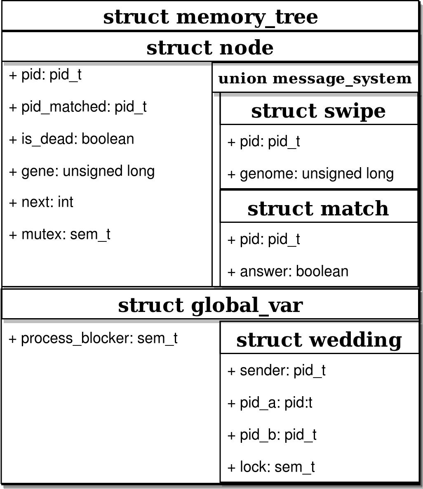

# Operating System project report - academic year 2017-18

## Abstract

---

The project structure was about the implementation of a piece of software that generates and manage processes and inter-process-communication.

## Project structure

---

The process that manage the whole project is the handler. I execute the handler when starting the execution of the software and it will execute the other two processes ("A" and "B"). We also get, from command line:

- *init_people*: number of processes I will generate through handler --- this number indicates the number of processes alive concurrently.
- *genes*: value used as range to generate random value for the genome.
- *birth_death*: every birth_death seconds, I kill a random process and generate a new one.
- *sim_time*: simulation time expressed in seconds.

Whenever I create a new process, I assign a random genome --- its value have $x$ to $x + genes$ value, where $x$ is $0$ when the simulation starts.
I give each process a name, by appending a random character to an array --- initially empty. I developed the function that handles the process naming in such a way to ensure major efficiency when generating children of children.
I handled process types as:

- If, up to the penultimate element, I only have "B" elements, I will need to generate a "B" process --- it would block otherwise
- If, up to the penultimate element, I only have "A" elements, I will need to generate a "A" process
- Random otherwise

The handler generates new processes by forking, generating new values for the process and execute them by passing the values via *execve*

## Processes life-cycle

---

### Process A

Processes of type A wait to communicate with B processes. They decide wether or not to match with them based on two factors:

1. If process B's genome is a multiple of the process A's one they match
2. If $gcd(genomeA, genomeB) > \frac{genomeA}{adaptability\_factor}$ where the *adaptability_factor* is the value that adapt the preference of a process A when choosing a partner. Initially set to $1$, when it refuses $5$ a process B it will be easier to match --- and avoid being lonely forever.

### Process B

Process of type B try to get in contact with process A in order to have a match. They evaluate the $gcd$ of both their genome and process A's one to ensure their children will have a suitable genome --- they check $gcd > 1$ --- then start contacting the relative process A. To avoid that more than one process of type B get in touch with the same process of type A, I implemented a semaphore system.
Both processes, when matched, will communicate the handler their information, then terminate. The handler will save the incoming data to generate children accordingly:

- *name*: the child's name will be generated from the parents' name with a random character appended.
- *genome*: the genome is a random value in the range $x$ to $x+genes$ where $x$ is the *gcd* of the parents' genomes.

## Semaphores

---

I implemented the semaphores, throughout the project, with POSIX semaphores generating three different kind of semaphores:

1. The first one handles the initialization of the processes. I block them until we have generated all the initial processes --- whose number is defined with *init_people* --- and then release the lock.
2. The second one handles the processes' life-cycle. It prevents process B to try establishing a communication with a process of type A, if it's already busy
3. The last semaphores handle the communication between processes and the handler itself. When a process get a match, both processes will communicate with the handler before terminating. When this happens, they will need to get the lock on the semaphore, communicate the handler its information, and then release the semaphore.

### POSIX semaphores vs System V semaphores

As previously mentioned, I opted for POSIX semaphores over System V one. The main reasons for this choice were:

- System V semaphores con increment or decrement the semaphore counter of a specified value, whereas the POSIX one always perform this task of a single unit. As such, POSIX semaphores were easier to maintain.
- POSIX semaphores do not allow permission manipulation --- easier to maintain if not needed.
- They are relatively lighter and have an overall better performance.
- POSIX semaphores are non persistent --- this may be a problem if not well controlled

I also found POSIX semaphores to be, after all, easier to implement and use, especially when using the function `sem_trywait` for an asyncronous task.

## Shared Memory management

In order to get the process A's data and for inter-process communication, I implemented a deep structure in the shared memory.
The structure consists of:

- A structure containing process A's values and two structure inside an union with the swipe structure --- process B will use this to establish a connection --- and a match structure --- process A will use this to answer to swipes. I used an union so that the memory will be naturally shared inside it.
- A structure of global elements in which, apart from the semaphore used for processes initially, we also have a structure used by processes to communicate with the handler.

### Inter-process communication

Initially I took in consideration:

a. Pipe: create a pipe with four file descriptor --- two for reading and two for writing --- in order to have a complete communication between processes. When we do a fork, however, processes will inherit file descriptors from the father as the were created at the time. If, as happened, a child was created before the complete creation of all the file descriptors, it could not establish all the connections. I could bypass this by making the handler wait the generation until all file descriptors were created --- it would have slowed the simulation and it wasn't really clean. An other solution I considered was to pass the file descriptors inside a structure to the children. Even though it could have been possible, it would have weighted the generation of children even more.
b. Message Queue: this was a good possible idea. I could have created a structure that allows us to have good communication with possible asyncronous communication (with infinite buffer). I would need to make it distributed to avoid a possible saturation of the mailbox channel and I would have to be careful not to send messages to every process. Ii wanted to make something similar to this but with some custom filter and, for that, using a shared memory was a good choice.

## Makefile structure and Debug print

To execute the simulation in a quick and easy way, I created a Makefile that already take care of compiling with proper libraries and flags the code and run it with all the values we want to test.

For the debug prints, I just need to modify the value of `DEBUG_ENABLED` to achieve the desired outcome:

1. Value 1: the program will execute in verbose mode printing everything to screen --- irrelevant to the execution of the program
2. Value 2: the program will execute in verbose mode but it prints everything into a file *log.txt*
3. Anything else: it will ignore every debug print.

## Post-simulation outcomes

I tested the simulation with various values of the different variables. I attach the values reported after some of the simulations.

| Input             | Process generated | Longest name   | Biggest genome    |
|-------------------|-------------------|----------------|-------------------|
| (5, 15, 5, 10)    | 158               | 36             | 274               |
| (20, 15, 5, 20)   | 337               | 22             | 144               |
| (50, 20, 10, 40)  | 552               | 14             | 123               |
| (100, 20, 10, 60) | 460               | 6              | 86                |

It can be notices that, the more the number of the processes are added, the shortest the length of the name and the smaller the genome. A possible reason for this is due to the fact that, having more process working concurrently, the handler will have to process many more matches and the generations of the new processes.
Another reason for the fact that performance dropped with 100 processes is to be found in the system specification of the computer used and its processor.

## Possible runtime errors

During the simulation, due to the strong asyncronous nature of the project, CPU get scheduling problems. From time to time, the following errors were found:

- During simulation, the population gets saturated with just one type of element: even with the initial check, it happens, from time to time, that some processes are not yet identified as terminated and new processes gets generated before. The `birth_death` random death bypass this problem, since one random process will be killed and the check will enforce the generation of a process of different type.
- Resource problem: I haven't encountered this problem lately, but happened during development phase. The system could not handle and manage correctly resources for the simulation as they were requested. A system reboot could fix this, since restarting it would terminate all possible remaining traces of the previous processes.
- System block: mostly due to a possible fork bomb. When disabling the debug print, the number of processes generated would be so high to be unbearable for the system to sustain it. A `killall` system call would terminate all processes active.
